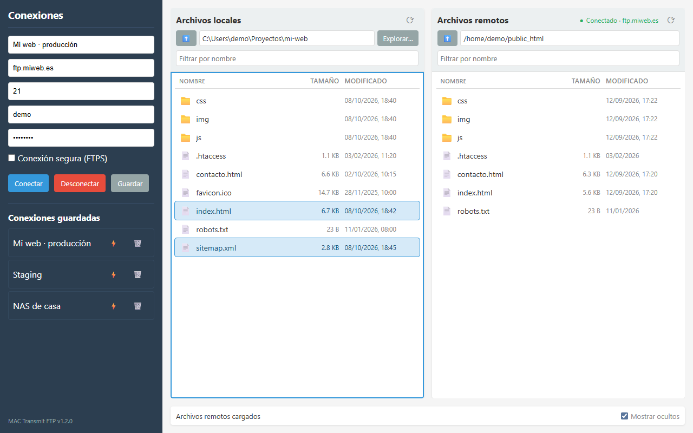
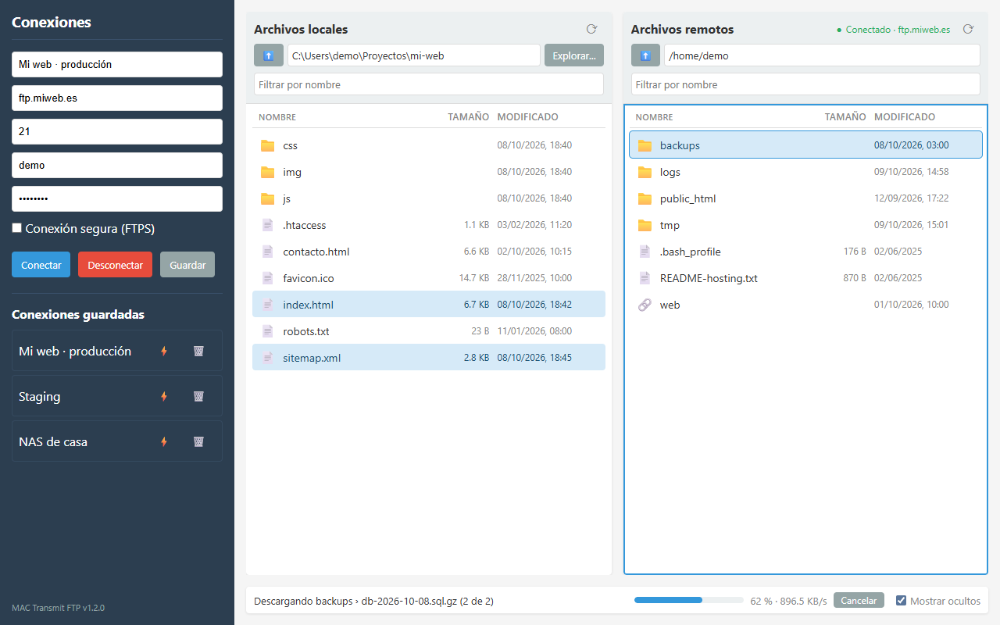
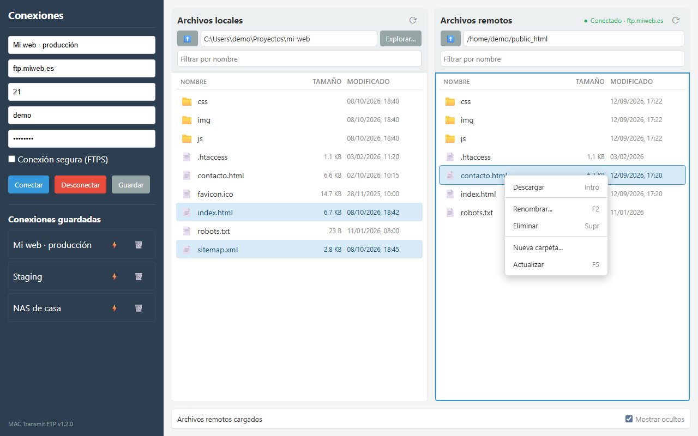
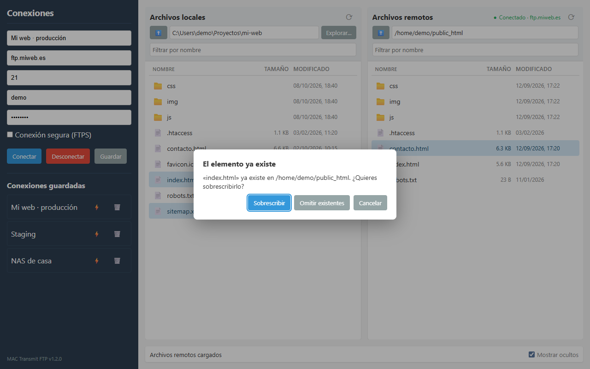
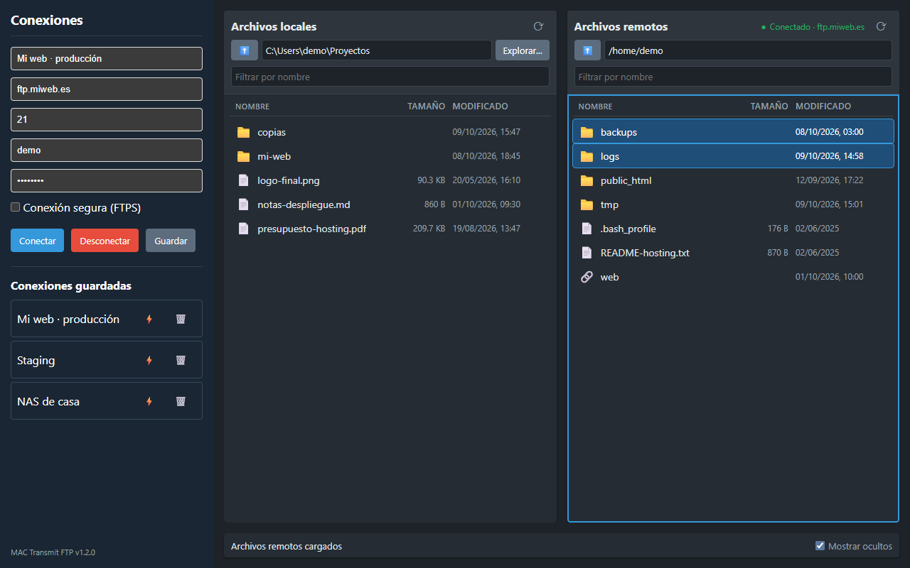

# MAC Transmit FTP

Cliente FTP/FTPS de escritorio con doble panel, construido con Electron e inspirado en Transmit. Tu equipo a la
izquierda, el servidor a la derecha: arrastra archivos o carpetas completas entre ellos y sigue cada transferencia con
su progreso real.

**Web y descargas:** https://cmurestudillos.github.io/mac-ftp/



## Características

- Conexión a servidores FTP y FTPS explícito (TLS); el panel remoto se abre en la carpeta de inicio del usuario
- Explorador de doble panel con carpetas primero, tamaño y fecha de modificación en ambos lados
- Selección múltiple (`Ctrl`/`Mayús`+clic) y atajos de teclado
- Subida y descarga de archivos y **carpetas completas**, con doble clic, `Intro`, menú contextual o arrastrando entre
  paneles; también se pueden soltar archivos del explorador del sistema en el panel remoto
- Cola de transferencias con progreso real (porcentaje, velocidad, archivo actual) y botón **Cancelar**, que elimina el
  archivo a medias
- Confirmación antes de sobrescribir: _Sobrescribir_, _Omitir existentes_ o _Cancelar_
- Menú contextual: renombrar, eliminar (a la papelera en local, definitivo en el servidor) y crear carpetas
- Filtro por nombre, botón actualizar y opción para ocultar los archivos que empiezan por punto
- Reconexión automática si el servidor corta la sesión
- Conexiones guardadas con la contraseña cifrada por el sistema operativo (safeStorage)
- Tema claro u oscuro según el sistema
- Multiplataforma: Windows, macOS (Apple Silicon) y Linux (AppImage)

## Capturas

| Transferencia de una carpeta                                    | Menú contextual                                                   |
| --------------------------------------------------------------- | ----------------------------------------------------------------- |
|  |  |

| Confirmación de sobrescritura                                       | Tema oscuro                                                    |
| ------------------------------------------------------------------- | -------------------------------------------------------------- |
|  |  |

## Instalación

### Descargar versión compilada

Descarga el instalador para tu sistema desde la [web](https://cmurestudillos.github.io/mac-ftp/#/descargas) o desde
[Releases](https://github.com/cmurestudillos/mac-ftp/releases). Los instaladores no están firmados:

- **Windows:** si SmartScreen avisa, _Más información → Ejecutar de todas formas_.
- **macOS:** si Gatekeeper la bloquea, clic derecho → _Abrir_, o `xattr -cr "/Applications/MAC Transmit FTP.app"`.
- **Linux:** `chmod +x MAC-Transmit-FTP-*.AppImage` (en Ubuntu 22.04+ puede hacer falta `libfuse2`).

### Desde el código

Requisitos: [Node.js](https://nodejs.org/) 22.12+ y [pnpm](https://pnpm.io/) 12.

```bash
git clone https://github.com/cmurestudillos/mac-ftp.git
cd mac-ftp
pnpm install
pnpm start
```

## Uso

1. **Conectar**: rellena host, puerto, usuario y contraseña (marca _Conexión segura (FTPS)_ si tu servidor usa TLS) y
   pulsa **Conectar**. **Desconectar** cierra la sesión.
2. **Guardar conexiones**: ponle un nombre y pulsa **Guardar**. En _Conexiones guardadas_, un clic rellena el
   formulario, ⚡ conecta y 🗑️ la elimina.
3. **Navegar**: doble clic en una carpeta para entrar, ⬆️ o `Retroceso` para subir, _Explorar…_ para abrir otra carpeta
   local.
4. **Transferir**: los elementos van a la carpeta abierta en el otro panel. Doble clic en un archivo, `Intro` con varios
   seleccionados, _Subir/Descargar_ en el menú contextual o arrastrar al otro panel.
5. **Gestionar archivos**: clic derecho para renombrar, eliminar o crear carpetas.

| Tecla                       | Acción                                                     |
| --------------------------- | ---------------------------------------------------------- |
| `Intro` · doble clic        | Abrir la carpeta o transferir la selección al otro panel   |
| `Retroceso`                 | Carpeta superior                                           |
| `↑` `↓` (`Mayús` para ampliar) | Moverse por la lista                                    |
| `Ctrl`+`A`                  | Seleccionar todo lo visible                                |
| `F2`                        | Renombrar                                                  |
| `Supr`                      | Eliminar (papelera en local, definitivo en el servidor)    |
| `F5`                        | Actualizar el panel                                        |
| `Esc`                       | Quitar la selección o cerrar el menú                       |

Limitaciones: no admite SFTP; FTPS solo explícito y con certificado válido; transferencias en modo pasivo y de una en
una.

## Desarrollo

```bash
pnpm start          # ejecutar en desarrollo (con el log FTP detallado en la consola)
pnpm lint           # ESLint
pnpm lint:fix
pnpm format:check   # Prettier
pnpm format

pnpm package:win    # instaladores en release/
pnpm package:mac    # solo desde un Mac
pnpm package:linux
```

### Landing (GitHub Pages)

La web está en `docs/` (HTML, CSS y JS sin dependencias ni build): router por hash, tema claro/oscuro y descargas que
se rellenan con la API de releases de GitHub. Se publica desde _Settings → Pages_ con la carpeta `/docs` de la rama
`master`.

### Regenerar las capturas

Las capturas de `docs/assets/screenshots/` son de la app real, generadas con un script de Electron que se carga antes
de `main.js` (`electron -r <script> .`) y que no forma parte del repositorio:

1. Arranca un servidor FTP local de pruebas con una carpeta de ejemplo (un alojamiento con `public_html`, `logs`,
   `backups`…) y crea un proyecto web local de ejemplo.
2. Sustituye los handlers IPC que tocan rutas (`get-home-directory`, `list-local-directory`, `ftp-transfer`…) para que
   la app muestre `C:\Users\demo\Proyectos` y el host `ftp.miweb.es`, y usa un `userData` temporal con conexiones de
   ejemplo.
3. Maneja la interfaz con `webContents.executeJavaScript` (clics, doble clic, arrastres, menú contextual) y captura a
   1280×800 con `webContents.invalidate()` + `capturePage()`, en tema claro y oscuro (`nativeTheme.themeSource`).

### Publicar una versión

El workflow `.github/workflows/release.yml` compila los instaladores de Windows (`.exe`), macOS (`.dmg` arm64) y Linux
(`.AppImage`) al subir un tag `vX.Y.Z` y los adjunta a un **borrador** de release.

1. Sube la versión en `package.json` (la app la muestra sola en la barra lateral) y haz commit.
2. Crea el tag, que debe coincidir con `package.json`: `git tag -a v1.2.0 -m "v1.2.0"`.
3. Sube la rama y el tag: `git push origin develop` y `git push origin v1.2.0`.
4. En _Actions_ espera a que **Release v1.2.0** termine (borrador + Windows + macOS + Linux).
5. Revisa el borrador en _Releases_ y pulsa **Publish release**: la web pasa sola a la nueva versión.

## Tecnologías utilizadas

- [Electron](https://www.electronjs.org/) — aplicaciones de escritorio con tecnologías web
- [basic-ftp](https://github.com/patrickjuchli/basic-ftp) — cliente FTP/FTPS para Node.js
- [electron-store](https://github.com/sindresorhus/electron-store) — persistencia de las conexiones guardadas
- [electron-builder](https://www.electron.build/) — instaladores y publicación en GitHub Releases

## Contribuciones

Las contribuciones son bienvenidas:

1. Haz fork del repositorio
2. Crea una rama para tu feature (`git checkout -b feature/amazing-feature`)
3. Haz commit de tus cambios (`git commit -m 'Add some amazing feature'`)
4. Push a la rama (`git push origin feature/amazing-feature`)
5. Abre un Pull Request

## Licencia

Distribuido bajo la Licencia ISC.
